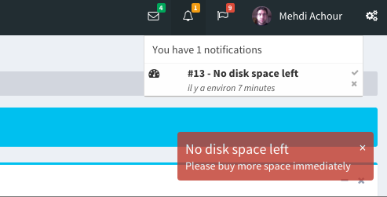

A complete notifications module for your Yii 2 powered application.

This module will install it's own table, and quickly allow you to:

* Trigger notifications to your users
* Toast these notifications on the screen using one of the supported UI libraries
* Manage a HTML list of notifications
  

A documentation is available [online](https://machour.idk.tn/yii/machour/yii2-notifications) and in the `docs` folder of the repository.
You can also check this [live demo](https://machour.idk.tn/yii2-kitchen-sink/site/yii2-notifications).
