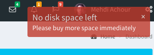

About
=====

This is a notifications module for your Yii 2 powered application.

This module will install it's own table, and quickly allow you to:
  * Trigger notifications to your users
  * Display these notifications using one of the supported UI libraries
  



Installation
------------

The preferred way to install this extension is through [composer](http://getcomposer.org/download/).

Either run

```
php composer.phar require --prefer-dist machour/yii2-notifications "@dev"
```

or add

```
"machour/yii2-notifications": "@dev"
```

to the require section of your `composer.json` file.


Configuration
-------------

Before using this module, you have to run its migrations scripts:

```
./yii migrate/up --migrationPath=vendor/machour/yii2-notifications/migrations/
```

You also need to enable the module in Yii `modules` section of the configuration file:
```php
return [
    // ...
    'modules' => [
        'notifications' => [
            'class' => 'machour\yii2\notifications\NotificationsModule',
            // Point this to your own Notification class
            // See the "Declaring your notifications" section below
            'notificationClass' => 'app\models\Notification',
            // This callable should return your logged in user Id
            'userId' => function() {
                return \Yii::$app->user->id;
            }
        ],
        // your other modules ..
    ],
    // ...
]
```


Concepts
--------

Usually, a notification displayed to the end user (on your web interface, or a push message), is made of a title (New
friendship request), a description (Foo Bar wants to be your friend), and a action url (/friends/add/FOOBAR_ID).
 
Notifications texts often needs to be translated, changed based on the current time or other parameters. The approach
taken by this module is to compute the notification title, description and url at run time, in order to give you a good
flexibility.

A notification may also be tied to a foreign object. In our friend ship request above, the foreign object will be the 
record representing the user Foo Bar.

This module represents a notification in the database using the following structure:

| Field      | Description                                                                           | 
| ---------- | ------------------------------------------------------------------------------------- |
| id         | The unique ID for the notification                                                    |
| type       | The notification severity (can be of `notification`, `success`, `error` or `warning`) |
| key        | The notification key (You decide here, for example: new_message, canceled_event)      |
| key_id     | The foreign object id, tied to your notification key. Defaults to NULL.               |
| user_id    | The notified user id                                                                  |
| seen       | Is the notification seen by the user or not                                           |
| created_at | Notification creation date                                                            |

See the *Declaring your notifications* in the **Usage** section to see how to declare your available notifications types
and dynamically compute their data.

Usage
-----

### Declaring your notifications

```php

namespace backend\components;

use Yii;
use common\models\Meeting;
use common\models\Message;
use machour\yii2\notifications\models\Notification as BaseNotification;

class Notification extends BaseNotification
{

    /**
     * A new message notification
     */
    const KEY_NEW_MESSAGE = 'new_message';
    /**
     * A meeting reminder notification
     */
    const KEY_MEETING_REMINDER = 'meeting_reminder';
    /**
     * No disk space left !
     */
    const KEY_NO_DISK_SPACE = 'no_disk_space';

    /**
     * @var array Holds all usable notifications
     */
    public static $keys = [
        self::KEY_NEW_MESSAGE,
        self::KEY_MEETING_REMINDER,
        self::KEY_NO_DISK_SPACE,
    ];

    /**
     * @inheritdoc
     */
    public function getTitle()
    {
        switch ($this->key) {
            case self::KEY_MEETING_REMINDER:
                return Yii::t('app', 'Meeting reminder');

            case self::KEY_NEW_MESSAGE:
                return Yii::t('app', 'You got a new message');
                
            case self::KEY_NO_DISK_SPACE:
                return Yii::t('app', 'No disk space left');
        }
    }

    /**
     * @inheritdoc
     */
    public function getDescription()
    {
        switch ($this->key) {
            case self::KEY_MEETING_REMINDER:
                $meeting = Meeting::findOne($this->key_id);
                return Yii::t('app', 'You are meeting with {customer}', ['customer' => $meeting->customer->name]);

            case self::KEY_NEW_MESSAGE:
                $message = Message::findOne($this->key_id);
                return Yii::t('app', '{customer} sent you a message', ['customer' => $meeting->customer->name]);

            case self::KEY_NO_DISK_SPACE:
                // We don't have a key_id here
                return 'Please buy more space immediately';
        }
    }

    /**
     * @inheritdoc
     */
    public function getRoute()
    {
        switch ($this->key) {
            case self::KEY_MEETING_REMINDER:
                return ['meeting', 'id' => $this->key_id];

            case self::KEY_NEW_MESSAGE:
                return ['message/read', 'id' => $this->key_id];

            case self::KEY_NO_DISK_SPACE:
                return 'https://aws.amazon.com/';
        };
    }

}
```

### Triggering a notification


```php

// $message was just created by the logged in user, and sent to $recipient_id
Notification::notify(Notification::KEY_NEW_MESSAGE, $recipient_id, $message->id);

// You may also use the following static methods to set the notification type:
Notification::warning(Notification::KEY_NEW_MESSAGE, $recipient_id, $message->id);
Notification::success(Notification::ORDER_PLACED, $admin_id, $order->id);
Notification::error(Notification::KEY_NO_DISK_SPACE, $admin_id);

```
          
### Listening and showing notifications in the UI

This package comes with a `NotificationsWidget` that can be used to regularly poll the server for new
notifications and trigger them visually using either jQuery Growl, or Noty.

When clicked, a notification will be marked as seen, and the user will be redirected to the notification
route.


This widget should be used in your main layout file as follows:

```php
use machour\yii2\notifications\widgets\NotificationsWidget;

NotificationsWidget::widget([
    'theme' => NotificationsWidget::THEME_GROWL,
     // If the notifications count changes, the $('.notifications-count') element
     // will be updated with the current count
    'counters' => ['.notifications-count'],
    'clientOptions' => [
        'size' => 'large',
    ],
]);
```

| Parameter      | Description                                                                 | Default     |
| -------------- | --------------------------------------------------------------------------- | -----------:|
| theme          | One of the THEME_XXX constants. See supported libraries for a full list     | THEME_GROWL |
| clientOptions  | An array of options to be passed to the underlying UI notifications library | []          |
| delay          | The time to leave the notification shown on screen                          | 5000        |
| pollInterval   | The delay in milliseconds between polls                                     | 5000        |
| pollSeen       | Whether to show already seen notifications                                  | false       |
| xhrTimeout     | The XHR request timeout in milliseconds                                     | 2000        |
| counters       | An array of jQuery selectors to update with the current notifications count | []          |


Supported libraries
-------------------

Currently supported libraries are:

| Library        | Constant      | Shipped version | Project homepage                         |
| -------------- | ------------- | --------------- | ---------------------------------------- |
| jQuery Growl   | THEME_GROWL   | 1.3.1           | https://github.com/ksylvest/jquery-growl |
| Notify.js      | THEME_NOTIFY  | 0.3.4           | https://notifyjs.com/                    |
| Noty           | THEME_NOTY    | 2.3.7           | http://ned.im/noty/                      |
| Toastr         | THEME_TOASTR  | 1.2.2           | https://github.com/CodeSeven/toastr      |

If you'de like to add support for another notification UI library, edit the `assets/notifications.js` file
ad add a new entry into the `Notification.themes` property.

Your library must be added as an object with the `show` callback field defined and used to trigger the visual
notification, and an optional `types` translation map that will be used to translate natives types into the
used library notification type.

You will also need to add the library javascript file and optional CSS file to the `assets/themes/` directory,
and declare the new theme in `widgets/NotificationsWidget.php`.

Don't forget to send a patch afterwards!

TODO
----

 * A widget that will display the notifications list, with a read/delete button
 * Email sending ?
 * Android Push / Apple Push integration ?
 

LICENSE
-------

The MIT License (MIT)

Copyright (c) 2015 Mehdi Achour

Permission is hereby granted, free of charge, to any person obtaining a copy
of this software and associated documentation files (the "Software"), to deal
in the Software without restriction, including without limitation the rights
to use, copy, modify, merge, publish, distribute, sublicense, and/or sell
copies of the Software, and to permit persons to whom the Software is
furnished to do so, subject to the following conditions:

The above copyright notice and this permission notice shall be included in all
copies or substantial portions of the Software.

THE SOFTWARE IS PROVIDED "AS IS", WITHOUT WARRANTY OF ANY KIND, EXPRESS OR
IMPLIED, INCLUDING BUT NOT LIMITED TO THE WARRANTIES OF MERCHANTABILITY,
FITNESS FOR A PARTICULAR PURPOSE AND NONINFRINGEMENT. IN NO EVENT SHALL THE
AUTHORS OR COPYRIGHT HOLDERS BE LIABLE FOR ANY CLAIM, DAMAGES OR OTHER
LIABILITY, WHETHER IN AN ACTION OF CONTRACT, TORT OR OTHERWISE, ARISING FROM,
OUT OF OR IN CONNECTION WITH THE SOFTWARE OR THE USE OR OTHER DEALINGS IN THE
SOFTWARE.

